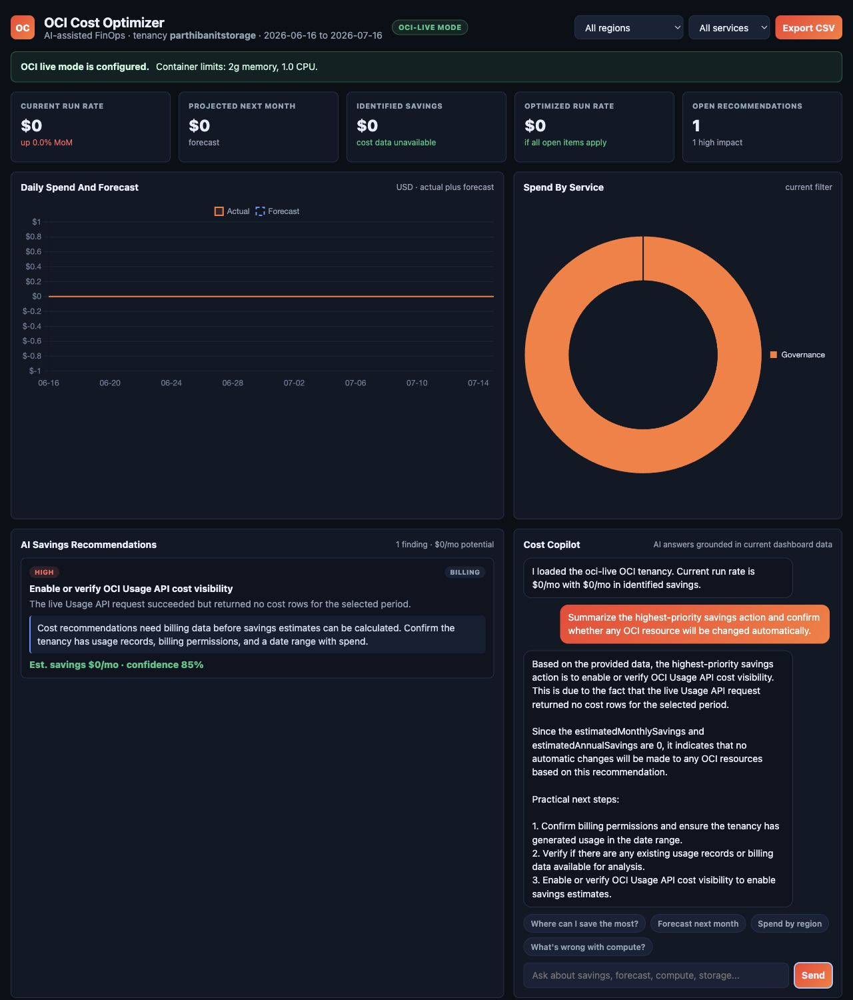

# OCI Cost Optimizer AI

Read-only OCI FinOps dashboard with live cost and inventory collection, evidence-backed savings recommendations, and a local Ollama Cost Copilot.

> **Safety contract:** the current application uses OCI read operations only. It does not delete, stop, resize, update, or otherwise mutate OCI resources.



## What It Does

- Connects to OCI Usage API, Resource Search, and IAM read endpoints.
- Shows cost KPIs, daily trend, service and compartment views, and visible resources.
- Generates prioritized, evidence-bound savings recommendations.
- Grounds Cost Copilot answers in the current dashboard context.
- Uses local Ollama by default for AI assistance; no cloud LLM key is required.
- Preserves deterministic mock mode as a demo fallback when live infrastructure is unavailable.
- Exports the current recommendation set as CSV.

## Current Status

| Capability | Status |
| --- | --- |
| Static responsive dashboard | Implemented |
| Strict live OCI mode | Implemented and tested |
| OCI Usage API through Python SDK | Implemented |
| OCI resource discovery through OCI CLI | Implemented |
| Analytics microservice | Implemented |
| Ollama agent microservice | Implemented |
| Read-only safety checks | Implemented and tested |
| Redis cache | Target state; not implemented |
| PostgreSQL recommendation state | Target state; not implemented |
| Authentication, RBAC, audit store, TLS ingress | Required before production exposure |

The repository is suitable for local engineering, demonstrations, and controlled read-only OCI evaluation. Complete the production checklist below before exposing it to enterprise users.

## Architecture


```text
Browser
  -> backend-api (/api/v1)
     -> analytics-engine
        -> OCI Usage API, Resource Search, IAM list/get
     -> agent-service
        -> local Ollama (llama3.2:3b)
```

Solid paths are implemented. Redis, PostgreSQL, durable audit state, and full observability are documented target-state capabilities.

Detailed references:

- [Product architecture](docs/oci-cost-optimizer-product-architecture.md)
- [Principal architecture blueprint](docs/principal-architecture-blueprint.md)
- [OCI cloud replica architecture](docs/oci-cloud-replica-architecture.md)
- [Minikube deployment plan](docs/minikube-deployment-plan.md)
- [Architecture decision records](docs/adr)

## Requirements

### Minimum Local Requirements

| Tool | Purpose | Recommended baseline |
| --- | --- | --- |
| macOS on Apple Silicon or Intel | Local workstation | Current supported macOS |
| Python | Backend and tests | 3.11 or later |
| OCI CLI | OCI read calls and profile validation | Current stable release |
| Ollama | Local AI inference | Current stable release |
| `llama3.2:3b` | Memory-conscious local model | Installed through Ollama |
| Git | Source control | Current stable release |

### k3d and Podman Requirements

- Podman Desktop or Podman machine running.
- `podman`, `k3d`, and `kubectl` available on `PATH`.
- At least 4 GB free memory for the cluster, services, and local Ollama.
- Port `8080` available for the backend port-forward.
- Port `11434` available for Ollama.

Install common macOS dependencies:

```bash
brew install python oci-cli ollama podman k3d kubectl
```

## Secure Configuration

Never commit `.env`, `.oci/`, PEM files, passwords, tokens, or API keys. They are ignored by Git and checked by `scripts/security_scan.py`.

Create local files from the safe examples:

```bash
cp .env.example .env
mkdir -p .oci
chmod 700 .oci
```

Use an OCI API-signing key dedicated to this application. Store the private key at `.oci/oci_api_key.pem` with mode `600`:

```bash
chmod 600 .oci/oci_api_key.pem
chmod 600 .oci/config
```

Example `.oci/config` structure:

```ini
[DEFAULT]
user=<user-ocid>
fingerprint=<api-key-fingerprint>
tenancy=<tenancy-ocid>
region=ap-mumbai-1
key_file=/absolute/path/to/.oci/oci_api_key.pem
```

Set strict live mode in `.env`:

```dotenv
APP_MODE=oci
DATA_PROVIDER=oci
OCI_ALLOW_MOCK_FALLBACK=false

OCI_TENANCY_OCID=<tenancy-ocid>
OCI_USER_OCID=<user-ocid>
OCI_FINGERPRINT=<api-key-fingerprint>
OCI_REGION=ap-mumbai-1
OCI_PROFILE=DEFAULT
OCI_CONFIG_FILE=.oci/config
OCI_KEY_FILE=/absolute/path/to/.oci/oci_api_key.pem
OCI_CLI_PATH=.venv/bin/oci

LLM_PROVIDER=ollama
OLLAMA_BASE_URL=http://127.0.0.1:11434
OLLAMA_MODEL=llama3.2:3b
```

Do not put an OpenAI key in `.env` when using Ollama.

### Required OCI Permissions

Grant the API-signing user or group only the read permissions needed for the selected tenancy and compartments. Validate the final policy with the OCI security owner. The application needs access equivalent to:

- Read tenancy and accessible compartments.
- Read resource inventory through Resource Search.
- Read usage and cost data through Usage API.
- Read regional metadata.

Do not grant manage, update, delete, instance-action, or resource-family mutation permissions to the dashboard identity.

## Installation

Create a project virtual environment and install the OCI CLI, which includes the OCI Python SDK used by cost queries:

```bash
python3 -m venv .venv
.venv/bin/python -m pip install --upgrade pip
.venv/bin/python -m pip install oci-cli
```

Start and prepare Ollama:

```bash
ollama serve
ollama pull llama3.2:3b
```

Verify credentials without changing resources:

```bash
.venv/bin/oci iam tenancy get \
  --tenancy-id <tenancy-ocid> \
  --config-file .oci/config \
  --profile DEFAULT \
  --auth api_key
```

## Run Locally in Strict OCI Mode

Run each service in a separate terminal from the repository root.

Analytics service:

```bash
APP_MODE=oci DATA_PROVIDER=oci OCI_ALLOW_MOCK_FALLBACK=false \
HOST=127.0.0.1 PORT=4311 PYTHONPATH=apps/backend-api/src \
.venv/bin/python -m oci_cost_optimizer.analytics_service
```

Ollama agent service:

```bash
APP_MODE=oci DATA_PROVIDER=oci OCI_ALLOW_MOCK_FALLBACK=false \
LLM_PROVIDER=ollama OLLAMA_BASE_URL=http://127.0.0.1:11434 \
OLLAMA_MODEL=llama3.2:3b HOST=127.0.0.1 PORT=4312 \
PYTHONPATH=apps/backend-api/src \
.venv/bin/python -m oci_cost_optimizer.agent_service
```

Public backend and frontend:

```bash
APP_MODE=oci DATA_PROVIDER=oci OCI_ALLOW_MOCK_FALLBACK=false \
LLM_PROVIDER=ollama OLLAMA_BASE_URL=http://127.0.0.1:11434 \
OLLAMA_MODEL=llama3.2:3b \
ANALYTICS_SERVICE_URL=http://127.0.0.1:4311 \
AGENT_SERVICE_URL=http://127.0.0.1:4312 \
HOST=127.0.0.1 PORT=4310 PYTHONPATH=apps/backend-api/src \
.venv/bin/python -m oci_cost_optimizer
```

Open [http://127.0.0.1:4310](http://127.0.0.1:4310).

## How to Use the Dashboard

1. Confirm the green header badge says `OCI-LIVE MODE` and the expected tenancy is shown.
2. Review current run rate, projection, identified savings, and open recommendations.
3. Use Region and Service filters to narrow all charts, recommendations, and resources.
4. Read each recommendation's evidence, action, confidence, and estimated monthly savings.
5. Ask Cost Copilot a focused question such as `Where can I save the most?`.
6. Treat Copilot output as advice for human review. The dashboard never applies a recommendation.
7. Select **Export CSV** to share the filtered recommendation set.

If the Usage API returns no billable rows, the dashboard displays zero cost and recommends validating billing permissions, date range, and usage availability. It does not invent savings estimates.

## Run with k3d and Podman

The checked-in k3d profile is a credential-free demo profile and defaults to mock data. It runs separate backend, analytics, and agent pods and connects the agent to Ollama on the Mac host.

```bash
podman machine start
scripts/k3d-up.sh
kubectl -n oci-cost-optimizer port-forward svc/backend-api 8080:80
```

Open [http://127.0.0.1:8080](http://127.0.0.1:8080).

Stop the stack:

```bash
scripts/k3d-down.sh
```

For strict live OCI mode in Kubernetes, create a private overlay that:

- Creates an `oci-credentials` Secret from the local config and private key.
- Mounts the Secret read-only at `/oci` in backend, analytics, and agent pods.
- Sets `APP_MODE=oci`, `DATA_PROVIDER=oci`, and `OCI_ALLOW_MOCK_FALLBACK=false`.
- Sets `OCI_CONFIG_FILE=/oci/config`, `OCI_KEY_FILE=/oci/oci_api_key.pem`, and the intended profile.
- Keeps Secret YAML, rendered manifests, and private overlays outside Git.

Do not paste a private key into a checked-in Kubernetes manifest.

## API

| Method | Endpoint | Purpose |
| --- | --- | --- |
| `GET` | `/api/v1/health` | Liveness |
| `GET` | `/api/v1/ready` | Dependency readiness |
| `GET` | `/api/v1/version` | API metadata |
| `GET` | `/api/v1/status` | Combined runtime status |
| `GET` | `/api/v1/setup` | OCI and LLM setup checks |
| `GET` | `/api/v1/dashboard` | Filtered dashboard payload |
| `GET` | `/api/v1/recommendations` | Recommendation payload |
| `POST` | `/api/v1/copilot` | Grounded Cost Copilot question |

Read-only examples:

```bash
curl -s http://127.0.0.1:4310/api/v1/health
curl -s http://127.0.0.1:4310/api/v1/ready
curl -s 'http://127.0.0.1:4310/api/v1/dashboard?region=all&service=all'
curl -s -X POST http://127.0.0.1:4310/api/v1/copilot \
  -H 'Content-Type: application/json' \
  -d '{"question":"Where can I save the most?","filters":{"region":"all","service":"all"}}'
```

## Testing

Run unit, functional, security, and static checks:

```bash
scripts/qa.sh
```

Run HTTP functional checks against a running deployment:

```bash
BASE_URL=http://127.0.0.1:4310 scripts/functional-test.sh
```

The security suite checks for committed secrets, private-key markers, mutating OCI operations, non-root Kubernetes workloads, dropped capabilities, and resource limits.

## Production Checklist

- Put the public API behind TLS, authentication, authorization, and rate limiting.
- Replace the current development HTTP server with a production ASGI server and typed API schemas.
- Store recommendation lifecycle, approvals, and audit events in PostgreSQL.
- Add bounded Redis caching with explicit TTLs and memory limits.
- Add structured logs, metrics, traces, SLOs, and alerting.
- Use OCI Vault or an external secrets operator for credentials.
- Restrict NetworkPolicies and egress to required OCI and Ollama endpoints.
- Add image signing, vulnerability scanning, SBOM generation, and admission policy.
- Add backup, restore, retention, and disaster-recovery procedures for stateful services.
- Add human approval and a separate privileged service before considering any future remediation automation.
- Perform threat modeling and independent penetration testing before internet or enterprise-wide exposure.

## Repository Layout

```text
apps/backend-api/   Public API, analytics service, agent service, tests
apps/frontend/      Responsive dashboard and setup UI
docs/               Architecture, ADRs, screenshots, publication assets
infra/terraform/oci OCI target infrastructure scaffold
k8s/k3d/            Local microservice manifests
scripts/            Build, cluster, QA, functional, and security tools
```

## License and Support

No license or formal support policy is currently declared. Add both before distributing the project outside its intended evaluation audience.
