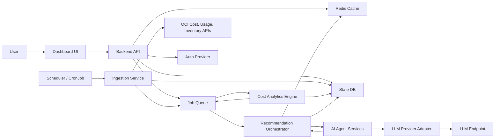
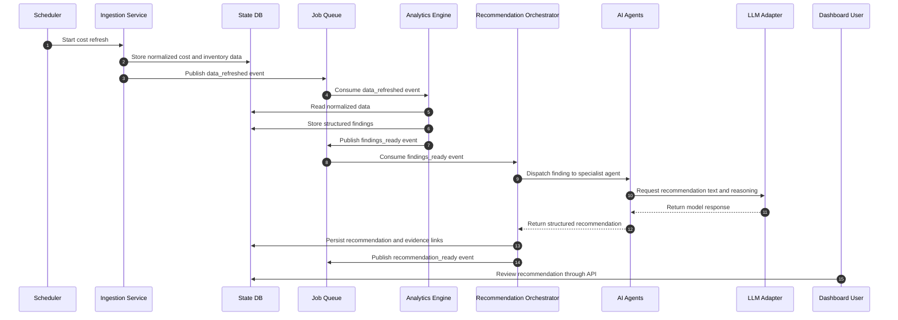
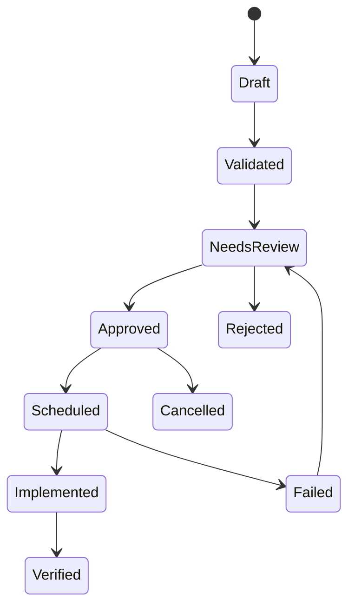

# OCI Cost Optimizer Dashboard with LLM Recommendations

## 1. Goal

Build a dashboard that collects OCI cost, usage, inventory, and performance signals, then uses rule-based analytics plus LLM-backed agents to recommend cost optimization actions.

The first delivery target is a standalone local Python/Node-style app on a Mac laptop. It should run without Kubernetes, external databases, or cloud credentials while preserving API contracts that can later move to Minikube and OCI-managed services.

## 2. Architecture Principles

- Start with a standalone local app that proves the dashboard workflow before adding distributed infrastructure.
- Keep cloud-specific integrations behind adapters so the system can move from local mocks to OCI APIs without rewriting application logic.
- Separate deterministic cost analysis from LLM recommendation generation.
- Store durable state in local fixtures or files during Phase 1; add a database when persistence is needed.
- Make recommendations auditable: every recommendation should include evidence, calculation inputs, confidence, owner, status, and action history.
- Prefer API contracts that can later support asynchronous ingestion and analysis without changing the frontend workflow.

See also:

- [Principal Architecture Blueprint](./principal-architecture-blueprint.md)
- [Architecture Decision Records](./adr)

## 3. Core Services

### Frontend Dashboard

Purpose:
- Display cost trends, optimization opportunities, recommendation details, and action status.
- Let users approve, reject, assign, or schedule optimization actions.

Local:
- Plain HTML/CSS/JavaScript or a lightweight Node-based UI served by the local backend.

OCI target:
- Containerized frontend on OKE, or static build on Object Storage plus CDN if the UI is fully static.

### API Gateway / Backend API

Purpose:
- Expose dashboard APIs.
- Handle authentication context.
- Coordinate reads from the database and cache.
- Submit analysis and recommendation jobs.

Local:
- A Python backend process serving REST-like JSON routes and static frontend assets.

OCI target:
- API service on OKE behind OCI Load Balancer or OCI API Gateway.

### Ingestion Service

Purpose:
- Pull cost, usage, budget, billing, resource inventory, and utilization data.
- Normalize raw cloud data into internal tables.
- Emit events when fresh data is available.

Local:
- Can start with fixture files, CSV uploads, or mocked OCI API responses.
- Later connect to real OCI APIs using local credentials.

OCI target:
- Uses OCI SDK, service connector patterns, scheduled jobs, and managed identity.

### Cost Analytics Engine

Purpose:
- Run deterministic analysis before LLM involvement.
- Detect underused resources, idle resources, expensive SKUs, unattached storage, oversizing, budget anomalies, reserved capacity candidates, and tagging gaps.
- Produce structured optimization findings.

Local:
- In-process Python module or local script.

OCI target:
- OKE workload, OCI Functions for smaller jobs, or Data Flow for larger batch workloads.

### Recommendation Orchestrator

Purpose:
- Convert structured findings into recommendation tasks.
- Select the right AI agent for each task.
- Collect agent outputs.
- Validate output format and persist final recommendations.

Local:
- In-process module or local script until background processing is required.

OCI target:
- OKE worker, OCI Queue, OCI Streaming, or OCI Functions depending on workload shape.

### AI Agent Services

Initial agents:
- Rightsizing Agent: recommends compute shape, OCPU, memory, and scale changes.
- Storage Agent: recommends block volume resizing, object lifecycle policy, and orphan cleanup.
- Database Cost Agent: recommends database shape, storage, backup, and license optimization.
- Network Cost Agent: detects high egress, NAT, load balancer, and cross-region transfer patterns.
- Commitment Agent: identifies reserved capacity, savings plan, or committed use candidates.
- Tagging and Governance Agent: recommends tag cleanup, owner mapping, chargeback, and policy improvements.
- Explanation Agent: converts validated findings into executive-friendly and engineer-friendly summaries.

Responsibilities:
- Consume structured evidence from analytics.
- Generate recommendation narrative, impact, risk, prerequisites, and implementation steps.
- Return machine-readable JSON with citations to internal evidence.

Guardrails:
- Agents do not directly mutate cloud resources.
- Agents do not invent cost numbers; savings estimates must come from the analytics engine.
- Agents must return confidence, assumptions, and missing data.
- High-risk actions require human approval.

### LLM Provider Adapter

Purpose:
- Hide provider-specific APIs from agents.
- Support local development with a mock LLM or hosted model.
- Support final OCI deployment using OCI Generative AI or another approved enterprise LLM provider.

Local:
- Mock provider for deterministic tests.
- Optional external LLM provider for real recommendations.

OCI target:
- OCI Generative AI or enterprise-approved model endpoint.

### State Database

Purpose:
- Durable application state.
- Raw normalized cost data.
- Resource inventory snapshots.
- Analytics findings.
- Recommendation records.
- User decisions and audit history.

Recommended local choice:
- Start with deterministic fixtures and local files. Add SQLite or PostgreSQL only when saved user decisions, imports, or audit history need persistence.

Recommended OCI target:
- OCI PostgreSQL-compatible managed database, Autonomous Database, or MySQL HeatWave depending on enterprise standards.

### Cache

Purpose:
- Speed up dashboard reads.
- Cache cost summaries, resource lookups, recommendation lists, and short-lived LLM context.
- Support distributed locks or job coordination if needed.

Recommended local choice:
- No cache in Phase 1 unless the local API becomes slow. Add Redis only when queueing, distributed locks, or repeated expensive reads justify it.

Recommended OCI target:
- OCI Cache with Redis-compatible service, or Redis running on OKE if managed cache is unavailable in the target region.

### Message Bus / Job Queue

Purpose:
- Decouple ingestion, analytics, and AI recommendation processing.
- Allow retries, dead-lettering, and independent scaling.

Recommended local choice:
- No message bus in Phase 1. Use local function calls or scripts, then add Redis streams or a database-backed queue when background jobs become real.
- Kafka-compatible broker only if event volume or replay needs justify it.

Recommended OCI target:
- OCI Queue for task queues.
- OCI Streaming for event streams and replay-heavy pipelines.

## 4. High-Level Service Flow

## 5. Recommendation Flow

## 6. State Model

Core tables:

- `cloud_accounts`: OCI tenancy, compartments, regions, and account metadata.
- `cost_daily`: normalized daily cost by service, compartment, tag, region, and SKU.
- `usage_daily`: normalized usage metrics by resource.
- `resources`: current resource inventory.
- `resource_snapshots`: point-in-time resource state.
- `utilization_metrics`: CPU, memory, network, storage, and database utilization.
- `analytics_findings`: deterministic optimization findings.
- `recommendations`: final recommendations shown to users.
- `recommendation_evidence`: source records used by each recommendation.
- `recommendation_actions`: approval, rejection, assignment, and execution history.
- `agent_runs`: prompt metadata, model metadata, token usage, latency, and output status.
- `policies`: configurable thresholds for rightsizing and governance.
- `users`: dashboard users and roles.

Recommendation lifecycle:

## 7. Local Minikube Deployment

Local services:

- `frontend`
- `backend-api`
- `ingestion-service`
- `analytics-engine`
- `recommendation-orchestrator`
- `agent-service`
- `postgres`
- `redis`
- `worker` or `scheduler`
- `ingress-nginx`

Local Kubernetes resources:

- Namespace: `oci-cost-optimizer`
- Deployments: stateless app services
- StatefulSets: PostgreSQL and Redis if persistence is needed
- CronJobs: scheduled ingestion and analysis
- ConfigMaps: thresholds, feature flags, local mock settings
- Secrets: OCI config, LLM API keys, database password
- PersistentVolumes: PostgreSQL data
- Ingress: dashboard and API routes

Suggested local routes:

- `http://oci-cost.local`
- `http://oci-cost.local/api`

## 8. OCI Target Mapping

| Capability | Minikube | OCI Target |
| --- | --- | --- |
| Kubernetes runtime | Minikube | OKE |
| Container registry | Local Docker | OCI Container Registry |
| Ingress | NGINX Ingress | OCI Load Balancer or OCI API Gateway |
| Database | PostgreSQL StatefulSet | Managed PostgreSQL, Autonomous Database, or MySQL HeatWave |
| Cache | Redis StatefulSet | OCI Cache or Redis on OKE |
| Queue | Redis Streams | OCI Queue |
| Event stream | Optional local Kafka | OCI Streaming |
| Secrets | Kubernetes Secrets | OCI Vault plus Kubernetes Secrets Store CSI |
| Object storage | Local files or MinIO | OCI Object Storage |
| LLM | Mock or external provider | OCI Generative AI or approved model endpoint |
| Identity | Local dev auth | OCI IAM, IDCS, or enterprise IdP |
| Observability | Prometheus/Grafana locally | OCI Logging, Monitoring, APM, or managed observability stack |

## 9. Security and Governance

- Use least-privilege OCI policies for read-only cost and inventory collection.
- Separate recommendation generation from remediation execution.
- Store secrets in Kubernetes Secrets locally and OCI Vault in cloud.
- Log model inputs and outputs with sensitive fields redacted.
- Keep tenant, compartment, and resource OCIDs protected.
- Add role-based access for dashboard operations.
- Require approval for destructive or cost-impacting actions.
- Maintain an audit log for every user and agent decision.

## 10. Observability

Required telemetry:

- API latency and error rates.
- Ingestion success, duration, and freshness.
- Queue depth and retry counts.
- Agent run latency, token usage, and failure reasons.
- Recommendation count by status, service, and savings estimate.
- Cache hit ratio.
- Database query latency.

Local tools:

- Prometheus
- Grafana
- Loki or simple structured logs

OCI target:

- OCI Logging
- OCI Monitoring
- OCI APM
- OCI Notifications for alerting

## 11. Build Phases

### Phase 1: Local Skeleton

- Create Kubernetes namespace and base manifests.
- Create PostgreSQL and Redis local deployments.
- Build backend API health endpoints.
- Build dashboard shell.
- Add mock ingestion from fixture data.

### Phase 2: Data and Analytics

- Define database schema.
- Normalize cost, usage, and inventory data.
- Implement analytics findings.
- Add recommendation lifecycle APIs.

### Phase 3: AI Agents

- Add LLM provider adapter.
- Add mock LLM mode for local tests.
- Implement specialist agents.
- Persist agent runs and structured outputs.

### Phase 4: Dashboard Workflows

- Show cost summaries, findings, and recommendations.
- Add filters by compartment, service, tag, and region.
- Add approve, reject, assign, and export actions.

### Phase 5: OCI Integration

- Replace mock ingestion with OCI SDK integration.
- Add OCI IAM policies.
- Push containers to OCI Container Registry.
- Deploy to OKE.
- Replace local secrets and storage with OCI-managed services.

### Phase 6: Controlled Remediation

- Generate Terraform, CLI, or runbook actions.
- Add approval workflow.
- Add post-change verification.
- Keep auto-remediation disabled until governance is mature.
