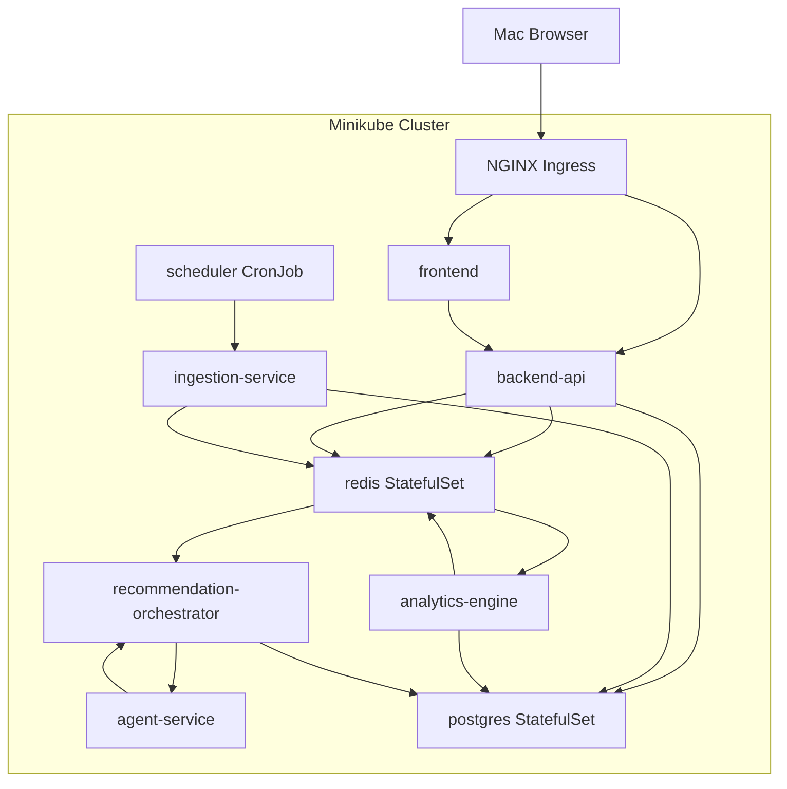

# Minikube Deployment Plan

## Local Namespace

Use one namespace for the first local environment:

```text
oci-cost-optimizer
```

## Local Service Topology



## Containers

| Container | Purpose | Scaling |
| --- | --- | --- |
| `frontend` | Dashboard UI | Horizontal, stateless |
| `backend-api` | Dashboard APIs and auth boundary | Horizontal, stateless |
| `ingestion-service` | Pulls OCI or fixture data | Horizontal by account or region |
| `analytics-engine` | Creates deterministic findings | Horizontal workers |
| `recommendation-orchestrator` | Coordinates AI agent tasks | Horizontal workers |
| `agent-service` | Runs specialist recommendation agents | Horizontal workers |
| `postgres` | Durable state | Single local instance |
| `redis` | Cache and local job queue | Single local instance |

## ConfigMaps

`app-config`:

```yaml
ENVIRONMENT: local
LOG_LEVEL: info
CACHE_TTL_SECONDS: "300"
INGESTION_MODE: fixture
LLM_PROVIDER: mock
RECOMMENDATION_MIN_CONFIDENCE: "0.65"
```

`optimizer-thresholds`:

```yaml
CPU_LOW_UTILIZATION_PERCENT: "20"
MEMORY_LOW_UTILIZATION_PERCENT: "35"
IDLE_DAYS: "14"
MIN_MONTHLY_SAVINGS_USD: "25"
RIGHTSIZING_LOOKBACK_DAYS: "30"
```

## Secrets

Local Kubernetes secrets:

- `database-secret`
- `redis-secret`
- `oci-credentials`
- `llm-provider-secret`

For local fixture mode, `oci-credentials` and `llm-provider-secret` can be empty placeholders.

## Persistent Volumes

Required:

- PostgreSQL data volume.

Optional:

- Redis persistence volume if Redis streams are used as a local queue and replay matters.

## Initial API Surface

Dashboard APIs:

- `GET /health`
- `GET /api/v1/cost/summary`
- `GET /api/v1/cost/trends`
- `GET /api/v1/resources`
- `GET /api/v1/findings`
- `GET /api/v1/recommendations`
- `GET /api/v1/recommendations/{id}`
- `POST /api/v1/recommendations/{id}/approve`
- `POST /api/v1/recommendations/{id}/reject`
- `POST /api/v1/jobs/ingest`
- `POST /api/v1/jobs/analyze`

Worker internal APIs or queue commands:

- `cost.data_refreshed`
- `cost.analysis_requested`
- `cost.findings_ready`
- `recommendation.requested`
- `recommendation.ready`
- `recommendation.failed`

## Local Development Flow

1. Start Minikube.
2. Enable ingress.
3. Build local container images.
4. Apply namespace, secrets, ConfigMaps, database, cache, and app manifests.
5. Load fixture cost and inventory data.
6. Run analytics job.
7. Run recommendation job with mock LLM.
8. Open dashboard at `http://oci-cost.local`.

## First Kubernetes Manifests to Create

Recommended folder structure:

```text
k8s/
  base/
    namespace.yaml
    configmap.yaml
    secrets.example.yaml
    postgres.yaml
    redis.yaml
    backend-api.yaml
    frontend.yaml
    ingestion-service.yaml
    analytics-engine.yaml
    recommendation-orchestrator.yaml
    agent-service.yaml
    scheduler.yaml
    ingress.yaml
```

## Migration Path to OCI

Keep the same container boundaries when moving to OCI. Replace only infrastructure bindings:

- Local image build becomes OCI Container Registry push.
- Minikube becomes OKE.
- Local Kubernetes secrets become OCI Vault-backed secrets.
- Local PostgreSQL becomes managed database.
- Local Redis becomes managed cache or Redis on OKE.
- Fixture ingestion becomes OCI SDK ingestion.
- Mock LLM becomes OCI Generative AI or approved model endpoint.

