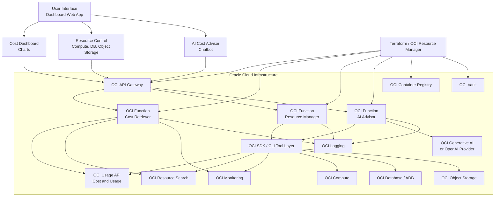
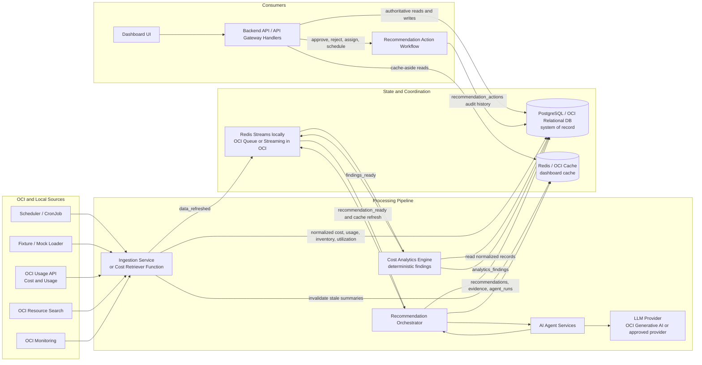

# OCI Cost Optimizer Dashboard: Project Architecture

This is the Oracle Cloud replica of the AWS reference architecture in the design image. The shape is intentionally similar: a dashboard calls an API gateway, the gateway fans out to serverless handlers, handlers use cloud cost/resource APIs, and Terraform/OCI Resource Manager owns repeatable deployment.

## AWS to OCI Mapping

| AWS reference component | OCI equivalent |
| --- | --- |
| Streamlit web app | Static dashboard, Streamlit container, or frontend served by `backend-api` |
| AWS API Gateway | OCI API Gateway |
| Lambda: Cost Retriever | OCI Function: `cost-retriever` |
| Lambda: Resource Manager | OCI Function: `resource-manager` |
| Lambda: AI Agent | OCI Function: `ai-advisor` |
| AWS Cost Explorer | OCI Usage API and Cost Analysis exports |
| Boto3 resource actions | OCI SDK, OCI CLI, or Resource Principal calls |
| EC2 | OCI Compute instances |
| RDS | OCI Database, Autonomous Database, MySQL HeatWave |
| S3 | OCI Object Storage |
| OpenAI API | OCI Generative AI or approved OpenAI-compatible provider |
| Terraform | Terraform with OCI provider or OCI Resource Manager |

## Target OCI Architecture



## Database-Centric Data Flow

PostgreSQL is the target system of record for normalized OCI cost data, inventory snapshots, analytics findings, recommendations, evidence, user decisions, and agent runs. Redis sits beside it for cache-aside dashboard reads and lightweight local queue semantics; in OCI, the queue role can move to OCI Queue or OCI Streaming while Redis remains the hot-read cache.



Database write ownership:

- Ingestion writes `cost_daily`, `usage_daily`, `resources`, `resource_snapshots`, and `utilization_metrics`.
- Analytics reads normalized records and writes `analytics_findings`.
- The recommendation orchestrator writes `recommendations`, `recommendation_evidence`, and `agent_runs`.
- The API writes user-driven `recommendation_actions` and reads PostgreSQL as the authoritative fallback when Redis misses.

Current repository note: `backend-api` presently serves the dashboard contract from mock data or the live OCI adapter. The diagram above shows the target flow once the ingestion, analytics, recommendation, PostgreSQL, and Redis services are introduced behind the same `/api/v1` browser contract.

## API Gateway Routes

The gateway should expose the same public contract used by the app:

| Route | Backend | Purpose |
| --- | --- | --- |
| `GET /api/v1/health` | `backend-api` or health function | Liveness |
| `GET /api/v1/dashboard` | `cost-retriever` | Cost summary, trends, inventory, recommendations |
| `GET /api/v1/recommendations` | `ai-advisor` or `backend-api` | Recommendation list |
| `POST /api/v1/copilot` | `ai-advisor` | Chat and narrative advice |
| `POST /api/v1/resources/actions` | `resource-manager` | Stop, resize, tag, lifecycle, or policy actions |

For the current repository, `backend-api` remains the fastest deployable unit because it already serves the frontend and `/api/v1` contract. The serverless split can be introduced incrementally behind OCI API Gateway without changing the browser contract.

## Function Responsibilities

### Cost Retriever

- Read OCI Usage API for daily cost and service grouping.
- Read Resource Search for resource inventory.
- Read Monitoring metrics for utilization signals.
- Normalize data into the dashboard shape currently returned by `/api/v1/dashboard`.

### Resource Manager

- Accept only validated, auditable action requests.
- Support dry-run by default.
- Execute approved actions through OCI SDK with Resource Principal identity.
- Start with low-risk actions: add tags, apply object lifecycle policy, stop explicitly approved compute instances.

### AI Advisor

- Consume structured findings from cost analytics.
- Produce plain-language recommendation summaries.
- Use OCI Generative AI by default for OCI-only deployments.
- Optionally use OpenAI when enterprise policy allows it.
- Never mutate OCI resources directly.

## IAM Model

Use Resource Principals for Functions. Terraform creates a dynamic group for functions in the deployment compartment and grants least-privilege read policies first.

Recommended first policy surface:

- inspect compartments
- read usage reports
- read resource inventory/search results
- read metrics
- use OCI Generative AI
- manage selected resource families only when `enable_resource_mutation = true`

High-risk actions should require human approval and should be kept disabled in the first OCI deployment.

## Deployment Tracks

### Track A: Fastest OCI Replica

1. Build and push the existing `backend-api` image to OCI Container Registry.
2. Run it on OKE or OCI Container Instances.
3. Put OCI API Gateway or Load Balancer in front of it.
4. Enable `DATA_PROVIDER=oci`.
5. Use OCI config locally first, then move to Resource Principal or workload identity.

### Track B: Serverless Replica of the AWS Diagram

1. Build function images for `cost-retriever`, `resource-manager`, and `ai-advisor`.
2. Push them to OCI Container Registry.
3. Deploy OCI Functions application and API Gateway with Terraform.
4. Wire `/api/v1/dashboard`, `/api/v1/copilot`, and resource action routes to functions.
5. Move shared data contracts from `backend-api` into a common Python package.

## Repository Setup

The Terraform scaffold lives in:

```text
infra/terraform/oci
```

Use it as the OCI control plane foundation. It creates the network, container repository, Functions application, three functions, API Gateway, deployment routes, dynamic group, and IAM policies.
