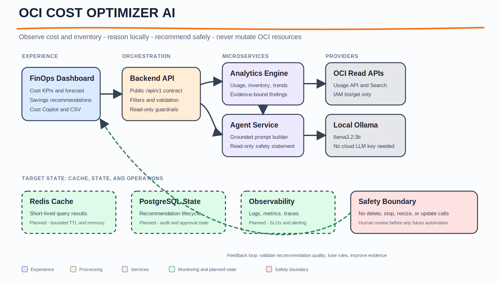
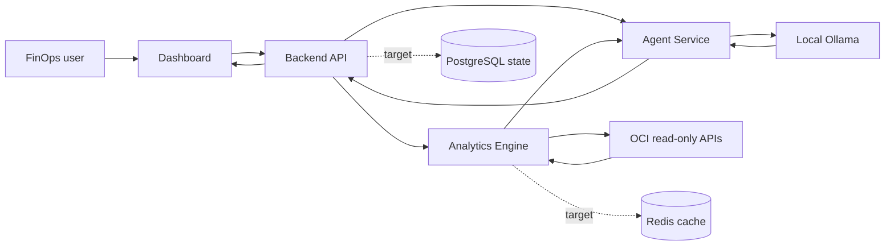

# OCI Cost Optimizer AI - Product Architecture

This diagram tells one story: how a FinOps user receives evidence-backed OCI cost recommendations without allowing the application to mutate OCI resources.

## Mermaid

## Excalidraw Layout

- Header: product name and the read-only recommendation promise.
- Main flow, left to right: dashboard, backend API, analytics and agent services, then OCI and Ollama providers.
- Target-state band: Redis, PostgreSQL, and observability use dashed borders so planned components cannot be confused with implemented services.
- Safety boundary: a red block states the operations that are intentionally absent.
- Feedback loop: recommendation outcomes feed rule and evidence quality improvements.

## Components

- **Dashboard:** presents KPIs, filters, recommendations, Cost Copilot, and CSV export.
- **Backend API:** exposes `/api/v1`, validates input, and coordinates internal services.
- **Analytics Engine:** queries OCI usage and inventory data and produces evidence-bound findings.
- **Agent Service:** grounds Ollama prompts in current dashboard data and enforces read-only language.
- **OCI read APIs:** Usage API, Resource Search, and IAM `list`/`get` operations only.
- **Local Ollama:** runs `llama3.2:3b` locally so the default AI path needs no cloud LLM key.
- **Redis/PostgreSQL/Observability:** target-state capabilities for caching, recommendation lifecycle state, audit, and operations.

## Color Legend

- Blue: user experience and inputs.
- Orange: request processing and orchestration.
- Purple: internal microservices.
- Gray: external providers.
- Green: monitoring, learning, cache, and state.
- Red: safety boundaries and prohibited actions.

## Presentation Notes

1. Start with the user outcome: cost visibility and a prioritized next action.
2. Follow the solid arrows to show the implemented read-only request path.
3. Explain that the local LLM receives summarized cost context, not authority to change resources.
4. Call out dashed target-state components as the production evolution path.
5. Finish on the safety boundary: no delete, stop, resize, or update calls exist in the current application.
