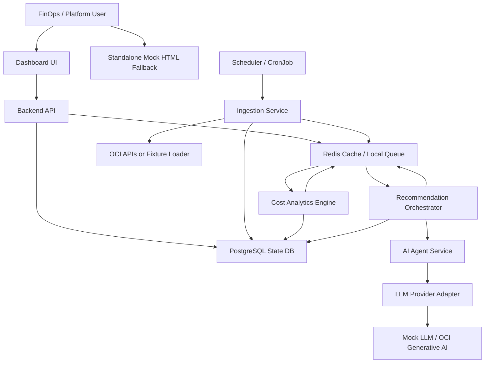
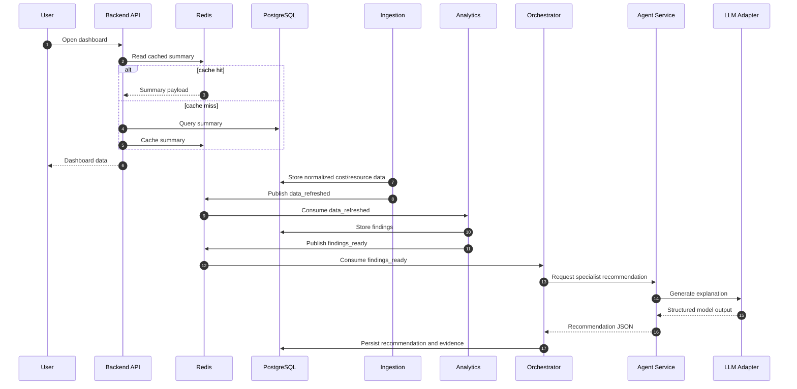
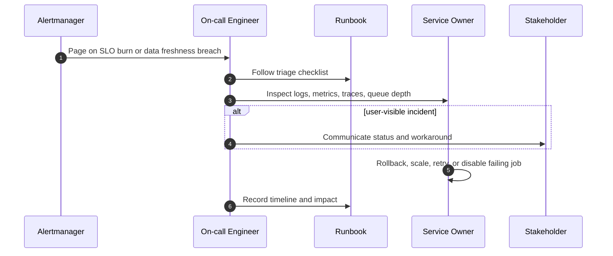

# Principal Architecture Blueprint

## 1. Problem Understanding

Build an OCI Cost Optimizer dashboard that can run locally on a Mac through Minikube, remain demoable through a standalone mock HTML dashboard, and later migrate to OCI-managed services. The platform must ingest cost and resource data, calculate deterministic optimization findings, use AI agents for recommendation explanations and prioritization, persist state in a database, and cache high-read dashboard data.

## 2. Assumptions

- Initial users are FinOps, platform engineering, and cloud operations teams.
- Local development uses Minikube with one-node availability and fixture data.
- Production deployment uses OCI Kubernetes Engine or equivalent OCI-managed services.
- Recommendations are advisory in early phases; no automatic remediation is enabled without approval.
- PostgreSQL is the system of record.
- Redis is used for cache and local lightweight job/event coordination.
- The standalone HTML prototype remains a mock-mode fallback even after backend services are built.

## 3. Requirements

### Functional Requirements

- Ingest OCI cost, usage, inventory, and utilization data.
- Normalize cloud data into durable tables.
- Detect cost optimization findings through deterministic analytics.
- Generate AI-assisted recommendations from structured findings.
- Display KPIs, trends, forecasts, service breakdowns, recommendations, and top resources.
- Provide a Cost Copilot interface for natural-language cost questions.
- Track recommendation lifecycle from draft through review, approval, implementation, and verification.
- Export recommendation reports.
- Support mock mode when Minikube or OCI connectivity fails.

### Non-Functional Requirements

- Availability: local demo best-effort; production target 99.9% for dashboard/API.
- Reliability: ingestion and recommendation workers must be retryable and idempotent.
- Security: least-privilege OCI access, encrypted secrets, audit logs, and no direct agent-driven mutations.
- Latency: dashboard reads should usually return under 500 ms from API/cache.
- Scalability: workers scale horizontally by tenancy, compartment, region, and job type.
- Cost: keep local stack small; move only necessary services to managed OCI components.
- Maintainability: clear service boundaries, adapter interfaces, and documented ADRs.
- Operability: health checks, metrics, logs, traces, runbooks, and alerting.

### Constraints

- Local-first deployment on a Mac laptop.
- Must remain presentable if Minikube is broken.
- Avoid overbuilding enterprise controls before the first working vertical slice.
- OCI service mappings should be explicit but not lock the local implementation to OCI-only APIs.

## 4. Architecture Options

| Attribute | Option A: Local MVP | Option B: Balanced Platform | Option C: Enterprise FinOps Platform |
| --- | --- | --- | --- |
| Runtime | Minikube only | Minikube then OKE | Multi-env OKE with GitOps |
| Services | Modular monolith plus workers | Microservices by domain | Microservices plus platform services |
| Queue | Redis Streams | Redis local, OCI Queue/Streaming later | OCI Streaming or Kafka-compatible event backbone |
| Database | PostgreSQL in cluster | PostgreSQL local, managed DB in OCI | Managed DB with HA, replicas, PITR |
| Cache | Redis in cluster | Redis local, OCI Cache later | Managed Redis with HA |
| AI | Mock LLM plus one provider adapter | Specialist agents behind orchestrator | Agent platform with memory, policy, evals, and governance |
| Reliability | Best effort | 99.9% target for API | 99.95%+ target for user-facing paths |
| Cost | Lowest | Moderate | Highest |
| Complexity | Low | Medium | High |

Recommendation: use Option B. It keeps the local workflow simple while preserving production-grade boundaries for OCI migration.

## 5. Recommended Architecture

Use a balanced cloud-native architecture:

- Frontend dashboard served from a container in Minikube, later OKE or Object Storage/CDN.
- Backend API as the main user-facing service.
- Ingestion service for OCI or fixture data.
- Cost analytics engine for deterministic findings.
- Recommendation orchestrator for agent dispatch, output validation, and persistence.
- AI agent service with specialist recommendation agents.
- LLM provider adapter with mock mode and future OCI Generative AI support.
- PostgreSQL as durable state.
- Redis as dashboard cache and local job stream.
- Mock HTML prototype as a permanent fallback demo path.

## 6. Architecture Diagram

## 7. Component Design

| Component | Responsibility | State | Scaling |
| --- | --- | --- | --- |
| Frontend | Dashboard, filters, recommendation workflow, copilot UI | Browser state only | Horizontal |
| Backend API | Auth boundary, query APIs, job triggers, export APIs | Stateless | Horizontal |
| Ingestion Service | Pull and normalize cost, usage, inventory, utilization | Writes normalized data | By tenancy, region, compartment |
| Analytics Engine | Deterministic savings findings | Writes findings | Worker replicas |
| Recommendation Orchestrator | Dispatch findings to agents, validate outputs, persist recommendations | Writes recommendations and agent runs | Worker replicas |
| Agent Service | Specialist AI recommendation generation | Stateless, optional short-lived context | Worker replicas |
| LLM Adapter | Provider abstraction, mock mode, request policy | Stateless | Horizontal |
| PostgreSQL | System of record | Durable | Managed HA later |
| Redis | Cache and local queue | Ephemeral or persisted local streams | Managed HA later |

## 8. Data Flow

## 9. Reliability Design

Target production SLOs:

| User Journey | SLI | SLO | Error Budget |
| --- | --- | --- | --- |
| Dashboard API availability | Successful non-5xx responses | 99.9% monthly | 43.2 min/month |
| Dashboard API latency | p95 response latency | < 500 ms | Track burn rate |
| Ingestion freshness | Data refreshed within schedule | 99% daily | 1 missed day per 100 |
| Recommendation generation | Successful completed jobs | 99% daily | 1 failed job per 100 |

Reliability controls:

- Readiness and liveness probes for all services.
- Idempotent ingestion keyed by tenancy, region, date, and source.
- Retry with exponential backoff for OCI and LLM calls.
- Dead-letter stream for failed analysis and recommendation jobs.
- Circuit breaker around LLM provider calls.
- Stale-data indicator in the dashboard.
- Mock dashboard fallback when local services are unavailable.

## 10. Failure Mode Analysis

| Component | Failure | Impact | Mitigation |
| --- | --- | --- | --- |
| Frontend | App container unavailable | Dashboard unavailable | Mock HTML fallback, multiple replicas in OCI |
| Backend API | Pod crash or bad deploy | API unavailable | Readiness probes, rollback, HPA, canary later |
| PostgreSQL | DB unavailable | Reads/writes fail | Backups, managed HA in OCI, connection pool limits |
| Redis | Cache or queue unavailable | Slower reads, worker backlog | Cache-aside fallback to DB, retry workers |
| Ingestion | OCI API throttling | Stale data | Backoff, rate limits, freshness alerts |
| Analytics | Rule bug | Bad findings | Versioned rules, tests, manual review |
| LLM provider | Timeout or bad output | Missing recommendation explanation | Mock fallback, schema validation, retry, mark as needs review |
| Network/DNS | Service discovery failure | Partial outage | Kubernetes DNS monitoring, retry, runbook |

## 11. Security Design

Security posture:

- Dashboard users authenticate through local dev auth first, enterprise IdP later.
- API authorizes actions by role.
- OCI ingestion uses read-only policies.
- Secrets stay in Kubernetes Secrets locally and OCI Vault later.
- Agents cannot mutate OCI resources.
- Recommendations include evidence and audit history.
- Prompt and output logs redact OCIDs, secrets, tokens, and sensitive tags.
- Container images are scanned before deployment.

STRIDE summary:

| Threat | Risk | Control |
| --- | --- | --- |
| Spoofing | Unauthorized dashboard/API access | AuthN, session validation, IdP integration |
| Tampering | Modified recommendation or cost data | DB constraints, audit log, signed images |
| Repudiation | User denies approval/rejection | Immutable action history |
| Information disclosure | Sensitive tenancy/resource data exposed | RBAC, redaction, encrypted secrets |
| Denial of service | API/LLM/OCI throttling | Rate limits, queue backpressure, circuit breakers |
| Elevation of privilege | Agent performs cloud mutation | No direct mutation permissions, approval workflow |

## 12. Observability Design

Metrics:

- API latency, error rate, request volume.
- Cache hit ratio.
- DB query latency and connection pool saturation.
- Queue depth, retry count, dead-letter count.
- Ingestion freshness and duration.
- Agent latency, token usage, failure rate, invalid JSON count.
- Recommendation counts by status, severity, service, and savings.

Logs:

- Structured JSON logs with correlation IDs.
- Redacted prompts and model outputs.
- Audit logs for recommendation actions.

Traces:

- OpenTelemetry from UI/API through worker job IDs.
- Trace ingestion, analytics, and recommendation pipelines.

Dashboards:

- Service health.
- Data freshness.
- Recommendation pipeline.
- LLM usage and failure modes.
- Cost optimization impact.

## 13. Incident Management Design

Runbooks to create:

- Dashboard API unavailable.
- Ingestion freshness breached.
- Recommendation jobs stuck.
- Redis unavailable.
- PostgreSQL unavailable.
- LLM provider degraded.

## 14. Disaster Recovery Strategy

Local:

- Rebuild Minikube from manifests.
- Restore fixture data.
- Use standalone HTML prototype for demos.

OCI:

- Managed database backups with point-in-time recovery.
- OCI Object Storage for raw exports and report artifacts.
- Container images in OCI Container Registry.
- GitOps source of truth for Kubernetes manifests.
- Document RTO/RPO once production tier is chosen.

Initial production target:

- RTO: 4 hours.
- RPO: 24 hours for analytics and recommendation data.
- Lower RPO later if recommendations become business-critical.

## 15. Scaling Strategy

- Scale API horizontally by request volume.
- Scale ingestion by tenancy, region, and compartment partitions.
- Scale analytics workers by queue depth.
- Scale recommendation workers by LLM rate limits and queue depth.
- Use cache for common dashboard reads.
- Partition large cost tables by date and tenancy.
- Add materialized views for dashboard KPIs if API latency exceeds SLO.

## 16. Cost Considerations

- Keep Minikube services small with single replicas and local persistence.
- Use Redis cache to reduce repeated DB reads.
- Run LLM only after deterministic findings exist.
- Store only evidence required for audit and recommendation quality.
- Prefer OCI Queue over heavier streaming if replay is not required.
- Use managed services in OCI where operational savings outweigh service cost.

## 17. Risks and Tradeoffs

| Risk | Tradeoff | Mitigation |
| --- | --- | --- |
| Too many microservices too early | Clean boundaries vs local complexity | Start with deployable services but keep code modular |
| LLM hallucination | Rich recommendations vs correctness risk | Deterministic savings, schema validation, evidence links |
| Redis as queue locally | Simple local setup vs weaker durability | Move to OCI Queue/Streaming for production |
| Mock HTML diverges from real app | Reliable demo vs duplicate behavior | Treat as visual/demo baseline, document live API mapping |
| OCI API throttling | Fresh data vs API limits | Backoff, scheduling, partitioned ingestion |

## 18. ADRs

Initial decisions:

- ADR-0001: Use a Minikube-first, OCI-ready architecture.
- ADR-0002: Keep the mock HTML dashboard as a permanent fallback.
- ADR-0003: Use PostgreSQL as the system of record.
- ADR-0004: Use Redis for cache and local queue semantics.
- ADR-0005: Separate deterministic analytics from AI recommendation generation.

## 19. Implementation Roadmap

1. Preserve and refine standalone HTML mock demo.
2. Scaffold app and Kubernetes folders.
3. Add PostgreSQL and Redis manifests.
4. Build backend API health and dashboard data endpoints.
5. Add fixture ingestion and schema migrations.
6. Implement deterministic analytics findings.
7. Add recommendation orchestrator and mock LLM adapter.
8. Build frontend from the existing dashboard template.
9. Add observability, runbooks, and production readiness checks.
10. Replace fixture ingestion with OCI SDK integration.
11. Deploy to OKE and replace local dependencies with OCI-managed services.

## 20. Production Readiness Checklist

- Health, readiness, and liveness probes.
- Resource requests and limits.
- HPA for stateless services.
- PDB for production replicas.
- Network policies.
- Secrets management and rotation plan.
- DB migrations with rollback strategy.
- Structured logs and correlation IDs.
- Metrics, dashboards, and alerts.
- Queue retry and dead-letter handling.
- Backup and restore test.
- Container image scanning.
- RBAC for dashboard actions.
- Audit log for recommendation lifecycle.
- Runbooks for top failure modes.
- Mock dashboard fallback verified.

